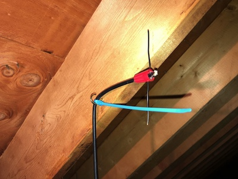
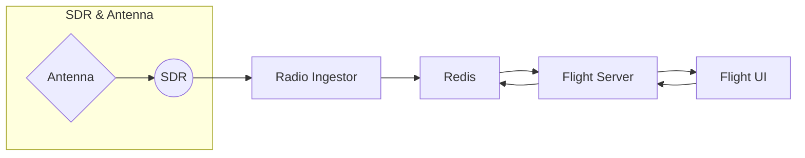

# Tracking aircraft with Redis + software-defined radio

I'm wrote a rather elaborate demo that tracks aircraft using Redis and Node.js. It does this by receiving aircraft transponder broadcasts and shoving them into an event stream in Redis.

There is no Internet involved in receiving these broadcasts. Instead, a hardware device called a software-defined radio (SDR) receives these broadcasts from the air and converts them into useful data that we can use. Which is pretty dang cool!

This repo contains the code and instructions you'll need to get it up and running for yourself.

I also have a talk about this. If you want to check out the [slides](/slides), they're in here too.

## Hardware requirements

This demo uses a software-defined radio. Despite the use of the word _software_ in its name, software-defined radio is actually a hardware device. So, you'll need to buy an SDR and an antenna to use this demo. No worries, SDRs are cheap.

Here's the load out I like to use. It includes the SDR dongle and an antenna specifically designed for picking up aircraft transponder broadcasts.

- **RTL SDR**: https://www.amazon.com/RTL-SDR-Blog-RTL2832U-Software-Defined/dp/B0CD745394/
- **ADS-B Antenna**: https://www.amazon.com/1090MHz-Antenna-Fiberglass-SMA-Male-Extension/dp/B09BQ4H26L/

If you want something cheaper and more general purpose, and this is probably a better choice, there are some bundles that include the same SDR and some more flexible antennas. This is a good choice if you want to do _other_ things with your SDR. Which will happen.

- **RTL SDR kit**: https://www.amazon.com/RTL-SDR-Blog-RTL2832U-Software-Defined/dp/B0CD7558GT/

You can also make your own antenna if you are ambitious. I'll leave that up to your own googling.

If you chose to make your own antenna or use the kit above, you'll want both legs of the antenna extended/cut to a length of ~69mm. Arrange them so that that are in a line, 180 degrees apart. This, in radio terms, is called a dipole.

Regardless of which antenna option you go with, you'll want to mount it vertically as this matches the way they are mounted on aircraft. Here's a picture of a homemade antena (not mine) mounted vertically in an attic (not mine):



Thanks for the picture, random Internt stranger!

## Installing SDR software

Installing SDR software can be a bit fiddly. You've been warned. That said, it has gotten easier over the years. You'll need two pieces of software to make this code work—besides, like, Node.js and stuff: the RTL SDR drivers, and dump1090.

### Installing the SDR drivers

These drivers allow your computer to talk to the SDR. And they provide lots of interesting command-line tools to boot. You'll need this to do, well, anything with your SDR.

#### Linux

```bash
sudo apt update
sudo apt install rtl-sdr
```

#### Mac

```bash
brew install rtl-sdr
```

#### Windows

You can download the RTL SDR drivers and tools from https://ftp.osmocom.org/binaries/windows/rtl-sdr/. They are built weekly so get the latest one for your platform—probably the 64-bit one. The download is just a ZIP full of .EXE and .DLL files. Put these files in a folder somewhere on your system and add that folder to your PATH to get it working.

Details on the drivers themselves can be found at https://osmocom.org/projects/rtl-sdr/wiki/Rtl-sdr.

#### Test the install

Regardless of your platform, testing is the same. Plug in your SDR and run the following command:

```bash
rtl_test
```

You should get back something like:

```
Found 1 device(s):
  0:  Realtek, RTL2838UHIDIR, SN: 00000001

Using device 0: Generic RTL2832U OEM
Detached kernel driver
Found Rafael Micro R820T tuner
Supported gain values (29): 0.0 0.9 1.4 2.7 3.7 7.7 8.7 12.5 14.4 15.7 16.6 19.7 20.7 22.9 25.4 28.0 29.7 32.8 33.8 36.4 37.2 38.6 40.2 42.1 43.4 43.9 44.5 48.0 49.6
[R82XX] PLL not locked!
Sampling at 2048000 S/s.

Info: This tool will continuously read from the device, and report if
samples get lost. If you observe no further output, everything is fine.

Reading samples in async mode...
Allocating 15 zero-copy buffers
lost at least 12 bytes
```

Hooray! Your drivers are working. Press Ctrl-C to stop and go to the next step.

### Installing dump1090

Dump1090 is a piece of software that uses the RTL SDR to listen to aircraft transponder broadcasts and present them to the user and make them available over a socket connection. The code in this repo uses that socket connection to read the broadcasts.

#### Linux

```bash
sudo apt install dump1090-mutability
```

You'll might be asked if you want to install this so that it always runs. I've only ever said no.

#### Mac

```bash
brew install dump1090-mutability
```

#### Windows

Windows has a lot of ports of dump1090. I like to use this one: https://github.com/MalcolmRobb/dump1090.

Just download the .ZIP file in the root of the repository—yes, it is really 10-years-old—and unzip it into a folder of your choice. From there, you can just run it from that folder or, if your prefer, add it to your path.

#### Testing the install

You should be able to now run dump-1090 using the follow command:

```bash
dump1090 --net --interactive
```

If you installed to Linux, you'll need to run this instead:

```bash
dump1090-mutability --net --interactive
```

If you have your antenna attached, aircraft should start showing up. Here's some that I found today while writing this README:

```
 Hex    Mode  Sqwk  Flight   Alt    Spd  Hdg    Lat      Long   RSSI  Msgs  Ti/
-------------------------------------------------------------------------------
 AD4C2A S                                                      -39.6     3  1
 A097CE S                    40000                             -32.5    11  0
 06A1DA S                    47000                             -33.4     7  0
 A71ABB S     7143           43000  476  272                   -33.1    18  1
 A280FE S                    40000  443  299   40.346  -83.589 -35.5     5  0
 A1FF90 S                     4000  230  294   39.920  -83.152 -28.2    13  0
 A59398 S     1512  AAL464   34975  472  082   40.013  -82.266 -27.4    55  0
 A05544 S                    43000  474  107   40.163  -82.640 -29.5    21  2
 A66312 S     1200  OSU51     1700   90  270   40.091  -83.082 -25.2    49  0
 A537ED S     6646  RPA4723  31000  439  103   39.867  -82.767 -28.0   100  0
 A05AAC S     6616  UCA4824  31000  431  102   39.984  -82.297 -23.8    39  0
 A16B47 S                    41000  491  045   40.486  -83.588 -31.7    39  1
 A69939 S     1546  EJA524    5925  240  275   39.909  -82.957 -25.0    64  0
 AC0B74 S           SWA4635  36000  455  267   40.523  -83.089 -28.6    94  0
 A0B990 S     6036           40000  423  322   39.488  -83.482 -26.7    56  0
 C07C7A S     7276           37000  467  053   40.124  -82.966 -19.3    56  0
```

## Running the demo

Now that we have the fiddly bits working, we can get the demo running. The demo itself is made of up four components: the _Radio Ingestor_, the _Flight Server_, the _Flight UI_, and _Redis_.



The purpose of the _Radio Ingestor_ is to take transponder broadcasts and write them to a Redis event stream. It is designed so that multiple instances can run at the same time feeding aircraft spots into Redis from multiple, geographically-dispersed locations.

The _Flight Server_ consumes the event stream, enriches it, and saves current flight status to Redis. It also publishes the enriched data as a WebSocket and provides simple HTTP APIs to query aircraft status and stats.

The _Flight UI_ presents flight data to the end user providing both map and detail views. It is designed to work alongside the _Flight Server_ and is useless without it.

### Quickstart

In a dedicated window, launch dump1090 with one of the following commands:

```bash
dump1090 --net --interactive              # for Mac or Windows
dump1090-mutability --net --interactive   # for Linux
```

The `--net` option tells dump1090 to publish transponder broadcasts on port 30003. The `--interactive` flag just makes it prettier.

Now, from the root of this repo run:

```bash
docker compose up --build
```

This will download Redis, build all the components, and start them up with defaults that will work. No fuss. No muss.

Once it's started, point your browser at http://localhost:8000 and watch the aircraft move about.

### Installing Redis and/or Redis Insight

Redis is where we're storing our aircraft spots. If you're not going with the quickstart, you'll need to have Redis somewhere. You can either install it locally, use Docker, or use Redis Cloud.

- To **install Redis locally**, follow the instructions at https://redis.io/docs/latest/operate/oss_and_stack/install/install-stack/.

- To **use Docker**, run the following command:

```bash
docker run -d --name redis-stack-server -p 6379:6379 redis/redis-stack-server:latest
```

- To **use Redis Cloud**, sign up for a free account at https://cloud.redis.io/.

You might also want to snag Redis Insight so you can see what Redis is doing. You can find that on the App Store, the Microsoft Store, or at https://redis.io/insight.

### Running just the Radio Ingestor

You'll need an existing Redis instance to do this. This might be local, but will probably be a Redis Cloud instance.

Before you run the _Radio Ingestor_, it must be configured. Details are in the the `sample.env` file in the `radio-ingestor` folder. However, the tl;dr is:

```bash
cd radio-ingestor
cp sample.env .env
```

Then edit the Redis options in the `.env` file to point to your Redis Cloud instance.

To run the _Radio Ingestor_ you can just use Docker:

```bash
docker compose up --build
```

If you'd rather run it using Node.js directly, then make sure you have Node.js installed and run the following commands:

```bash
cd radio-ingestor
npm install
npm run build
npm start
```

If you'd like to run it in dev mode instead you can skip the build:

```bash
cd radio-ingestor
npm install
npm run dev
```

You should be able to see an event stream in Redis, using Redis Insight of course, populating with aircraft transponder events.

### Running the Flight Server and Flight UI

Pending
